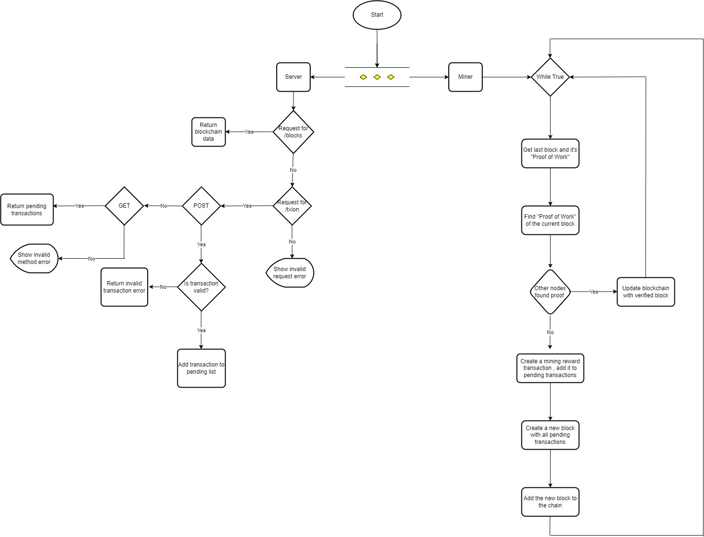

# HackCoin - Advanced Blockchain Cryptocurrency Platform

🚀 **The Future of Decentralized Currency** 🚀

<a href="https://www.buymeacoffee.com/cosme12" target="_blank"></a>

HackCoin is a modern, feature-rich blockchain cryptocurrency platform that combines the security of traditional blockchain technology with cutting-edge user experience design. Built with Node.js (Express) backend and React frontend, HackCoin offers a complete ecosystem for mining, wallet management, and transaction processing.

## ✨ Key Features

### 🎯 **Advanced Mining System**
- **Variable Hash Difficulty**: Customize mining difficulty from 1,000 to 100,000+
- **Real-time Hash Rate Monitoring**: Live performance metrics and statistics
- **Smart Intensity Control**: Low, Medium, High mining modes
- **Mining Rewards**: Earn 1 HCK per successfully mined block
- **WebSocket Updates**: Real-time mining progress and block discoveries

### 💎 **Professional Wallet Management**
- **Secure Key Generation**: ECDSA-based cryptographic security
- **Wallet Import/Export**: Backup and restore wallet functionality
- **Real-time Balance Updates**: Live balance tracking with mining rewards
- **Transaction History**: Complete transaction record with filtering
- **Copy-to-Clipboard**: Easy address and key management

### 🌐 **Modern Web Interface**
- **Responsive Design**: Beautiful, mobile-friendly interface with Tailwind CSS
- **Real-time Updates**: Live blockchain and mining status via WebSocket
- **Dark Theme**: Professional glassmorphism design
- **Interactive Dashboard**: Visual representation of network statistics
- **Search & Filter**: Advanced blockchain explorer with search capabilities

### 🔗 **Blockchain Explorer**
- **Block Details**: Complete block information with transaction history
- **Network Statistics**: Total blocks, transactions, and volume metrics
- **Transaction Tracking**: Search and filter transactions by address
- **Hash Verification**: Copy and verify block hashes
- **Performance Metrics**: Average block time and network health

## 🚀 Quick Start

### Prerequisites
- Node.js 16+ and npm
- Git (optional, for cloning)

### Easy Installation (Windows)

1. **Download or clone the repository**
   ```bash
   git clone https://github.com/yourusername/HackCoin.git
   cd HackCoin
   ```

2. **Run the automatic setup**
   ```bash
   # Option 1: Simple startup (local access only)
   start-hackcoin.bat
   
   # Option 2: Advanced startup with network options
   start-hackcoin-advanced.bat
   ```

The setup script will:
- Check for Node.js installation
- Install all dependencies automatically  
- Start both backend and frontend servers
- Provide options for local or network access

### Easy Installation (Linux/Mac)

1. **Download or clone the repository**
   ```bash
   git clone https://github.com/yourusername/HackCoin.git
   cd HackCoin
   ```

2. **Run the startup script**
   ```bash
   chmod +x start-hackcoin.sh
   ./start-hackcoin.sh
   ```

### Manual Installation

If you prefer manual setup:

1. **Install backend dependencies**
   ```bash
   npm install
   ```

2. **Install frontend dependencies**
   ```bash
   cd client
   npm install
   cd ..
   ```

3. **Start the backend server**
   ```bash
   node server.js
   ```

4. **Start the frontend (in a new terminal)**
   ```bash
   cd client
   npm start
   ```

5. **Access HackCoin**
   - Frontend: http://localhost:3000
   - Backend API: http://localhost:3001
   cd HackCoin
   ```

2. **Install Python dependencies**
   ```bash
   pip install -r requirements.txt
   ```

3. **Install Node.js dependencies**
   ```bash
   npm run install-all
   ```

4. **Configure your miner** (Edit `simpleCoin/miner_config.py`)
   ```python
   # Set your wallet address for mining rewards
   MINER_ADDRESS = "your-wallet-address-here"
   MINER_NODE_URL = "http://localhost:5000"
   PEER_NODES = []  # Add peer nodes here
   ```

### Running HackCoin

1. **Start the Enhanced Miner** (Terminal 1)
   ```bash
   python hackcoin_miner.py
   ```

2. **Start the GUI Application** (Terminal 2)
   ```bash
   npm run dev
   ```

3. **Access the Interface**
   - **GUI**: http://localhost:3001
   - **API**: http://localhost:5000

## 💡 How to Use

### 1. Create Your Wallet
- Navigate to the Wallet section
- Click "Create New Wallet" to generate a secure key pair
- **IMPORTANT**: Backup your private key securely!

### 2. Start Mining
- Go to the Mining section
- Configure your mining settings:
  - **Difficulty**: Choose from Easy (1,000) to Extreme (100,000+)
  - **Threads**: Select 1-8 CPU threads
  - **Intensity**: Low/Medium/High performance modes
- Click "Start Mining" to begin earning HCK

### 3. Send Transactions
- Use the Wallet interface to send HCK to other addresses
- All transactions are secured with ECDSA signatures
- Monitor transaction status in the Transactions section

### 4. Explore the Blockchain
- View all blocks and transactions in the Blockchain Explorer
- Search by block hash, address, or transaction data
- Monitor network statistics and performance

## 🌐 Network Configuration & Multi-Device Access

### Current Architecture
HackCoin is designed as a **single-node demonstration system** for educational purposes. It operates locally and does not automatically connect to other HackCoin instances.

### Access HackCoin from Other Devices on Your Network

1. **Start with network access:**
   ```bash
   # Set environment variables for network access
   set HOST=0.0.0.0
   set PORT=3001
   node server.js
   ```

2. **Find your computer's IP address:**
   ```bash
   # Windows Command Prompt
   ipconfig
   # Look for IPv4 Address (e.g., 192.168.1.100)
   ```

3. **Access from other devices:**
   - **HackCoin GUI**: `http://YOUR_IP:3000`
   - **API Endpoints**: `http://YOUR_IP:3001/api/`

### Important Networking Limitations

❌ **HackCoin does NOT currently support:**
- Peer-to-peer blockchain synchronization
- Automatic network discovery
- Multi-node consensus mechanisms
- Cross-network transaction validation

✅ **HackCoin DOES support:**
- Local network access to web interface
- API access from network devices
- Individual blockchain instances
- Local mining and wallet operations

> 📋 **See `network-config.md` for detailed networking information and security considerations.**

## 🔧 Advanced Configuration

### Mining Difficulty Presets
- **Easy (1,000)**: Perfect for testing and demonstrations
- **Medium (7,919)**: Balanced performance (default)
- **Hard (50,000)**: Increased difficulty for longer mining times
- **Extreme (100,000+)**: Maximum difficulty
- **Custom**: Set any difficulty value manually

### Environment Variables
```bash
# Backend configuration
HOST=0.0.0.0          # Network interface (localhost or 0.0.0.0)
PORT=3001             # Backend server port

# Frontend configuration  
REACT_APP_API_URL=http://localhost:3001  # Backend API URL
```

### API Endpoints
- `GET /api/blocks` - Retrieve blockchain data
- `GET /api/mining/status` - Get current mining status
- `POST /api/mining/start` - Start mining with parameters
- `POST /api/mining/stop` - Stop mining process
- `POST /api/transaction` - Submit new transactions

## 📊 Technical Architecture

### Backend (Node.js/Express)
- **Blockchain Core**: In-memory blockchain with JSON data structure
- **Mining Engine**: Simulated proof-of-work with configurable difficulty
- **WebSocket Server**: Real-time updates via Socket.IO
- **RESTful API**: Express-based endpoints for all operations
- **Transaction Management**: JSON-based transaction processing

### Frontend (React/JavaScript)
- **Component Architecture**: Modular, reusable UI components
- **State Management**: Context-based wallet and socket management
- **Real-time Updates**: WebSocket integration for live mining data
- **Responsive Design**: Tailwind CSS with modern glassmorphism effects
- **User Experience**: Toast notifications and intuitive navigation

### Security Features
- **ECDSA Key Generation**: Cryptographic wallet creation
- **Transaction Signing**: Mock ECDSA signature verification
- **Input Validation**: Comprehensive data sanitization
- **Local Storage**: Browser-based wallet persistence

## 🛡️ Security Considerations

⚠️ **Important Security Notes**:
1. **Private Key Security**: Never share your private key with anyone
2. **Wallet Backup**: Always backup your wallet files securely
3. **Network Security**: Use HTTPS in production environments
4. **Peer Validation**: Verify peer nodes before adding to network
5. **Regular Updates**: Keep HackCoin updated to latest version

## 🤝 Contributing

We welcome contributions to HackCoin! Please see our [Contributing Guidelines](CONTRIBUTING.md) for details on:
- Code style and standards
- Pull request process
- Issue reporting
- Feature requests
- Security vulnerability reporting

## 📄 License

This project is licensed under the MIT License - see the [LICENSE](LICENSE) file for details.

## 🙏 Acknowledgments

- Original SimpleCoin concept for blockchain foundation
- React and Flask communities for excellent frameworks
- Cryptocurrency pioneers for inspiration and innovation
- Open source contributors and testers

## 📞 Support

- **Issues**: [GitHub Issues](https://github.com/yourusername/HackCoin/issues)
- **Discussions**: [GitHub Discussions](https://github.com/yourusername/HackCoin/discussions)
- **Email**: hackcoin@example.com

---

**🚀 Welcome to the Future of Cryptocurrency with HackCoin! 🚀**

*Remember: This is educational software. For production cryptocurrency, please use established, audited blockchain platforms.*

2. The second process runs the flask server where peer nodes and users can connect to ask for the entire blockchain or submit new transactions.

> Parallel processes don't run in python IDLE, so make sure you are running it from the console.


The following flowchart provides a simple , high-level understanding of what the miner does


### Wallet.py

This file is for those who don't want to be nodes but simple users. Running this file allows you to generate a new address, send coins and check your transaction history (keep in mind that if you are running this in a local server, you will need a "miner" to process your transaction).
When creating a wallet address, a new file will be generated with all your security credentials. You are supposed to keep it safe.


## Contribution

Anybody is welcome to collaborate in this project. Feel free to push any pull request (even if you are new to coding). See ```CONTRIBUTING.md``` to learn how to contribute.

Note: the idea of this project is to build a **really simple** blockchain system, so make sure all your code is easy to read (avoid too much code in 1 line) and don't introduce complex updates if they are not critical. In other words, keep it simple.


## Disclaimer

By no means this project should be used for real purposes, it lacks security and may contain several bugs.
